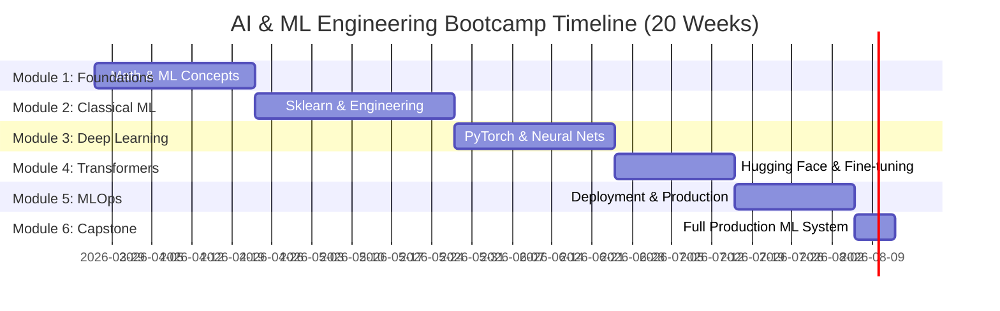
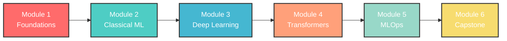

# Welcome to AI & Machine Learning Engineering Bootcamp Batch 3

<div align="center">
  
</div>

---

## Welcome, Future ML Engineers!

Congratulations on taking the first step toward becoming an AI & Machine Learning engineer! Over the next 10 weeks, you'll transform from someone who uses ML models to someone who builds, trains, and deploys them in production.

### A Word on Learning

**Here's the truth**: Practical ML knowledge doesn't come from just watching tutorials or reading papers alone.

You won't become an ML engineer by:
- ❌ Just watching lecture videos
- ❌ Only reading documentation and research papers
- ❌ Passively listening to theory
- ❌ Copy-pasting code without understanding

You WILL become an ML engineer by:
- ✅ **Writing code and training models every single day**
- ✅ **Building projects with real datasets**
- ✅ **Debugging model performance and fixing issues**
- ✅ **Experimenting with different architectures**
- ✅ **Asking questions when concepts are unclear**
- ✅ **Practicing beyond class hours**
- ✅ **Reading and implementing research papers**

Think of it like learning to play an instrument—you can watch master musicians perform, but you won't truly learn until you pick up the instrument yourself and start practicing (and yes, your first models might not perform well, and that's perfectly okay!).

### Our Commitment to You

We've structured this bootcamp with a balance between mathematical foundations, theory, and hands-on practice. But here's the secret: the real learning happens when you experiment with models on your own. The homework, the Kaggle competitions, the debugging at midnight—that's where the magic happens.

**Remember**: Every expert ML engineer you admire was once exactly where you are now. The difference? They kept training models when the results weren't perfect.

Ready? Let's build something intelligent!

---

## Program Overview
- **Duration**: 20 weeks (60 hours)
- **Schedule**: Thursday & Friday, 1.5 hours/day (theory + practice)
- **Weekly Commitment**: 3 hours in-class + 4-6 hours homework/practice
- **Total Hours**: 60 hours of instruction + extensive hands-on practice
- **Approach**: Mathematical foundations → Classical ML → Deep Learning → Transformers → MLOps



### Learning Journey



---

## 🛠️ Tech Stack

<div align="center">
  <table>
    <tr>
      <td align="center" style="padding: 10px;">
        
      </td>
      <td align="center" style="padding: 10px;">
        
      </td>
      <td align="center" style="padding: 10px;">
        
      </td>
      <td align="center" style="padding: 10px;">
        
      </td>
    </tr>
    <tr>
      <td align="center" style="padding: 10px;">
        
      </td>
      <td align="center" style="padding: 10px;">
        
      </td>
      <td align="center" style="padding: 10px;">
        
      </td>
      <td align="center" style="padding: 10px;">
        
      </td>
    </tr>
    <tr>
      <td align="center" style="padding: 10px;">
        
      </td>
      <td align="center" style="padding: 10px;">
        
      </td>
      <td align="center" style="padding: 10px;">
        
      </td>
      <td align="center" style="padding: 10px;">
        
      </td>
    </tr>
  </table>
</div>

---

## Module Timeline

### Module 1: Foundations for Machine Learning (12 Hours - 4 Weeks)
**Mathematical & Conceptual Foundations - Building blocks for ML**
*Prerequisite: Python fundamentals, basic mathematics*

📚 **[Module 1 Overview](modules/1-foundations/README.md)**

#### Week 1: Introduction to Machine Learning (3 hours)

**Day 1 (Thursday) - AI, ML & Deep Learning Landscape** | 1.5 hours | [📖 Lesson](modules/1-foundations/docs/w1d1-ai-ml-landscape.md) | [📝 Homework](modules/1-foundations/homeworks/w1d1-homework.md) | [▶️ Video](https://drive.google.com/file/d/1LPs5sbl4BwVrbxIKj9e9lxxb34y2pjfE/view?usp=sharing)
- Theory (45 min): AI vs ML vs Deep Learning, ML applications, ML lifecycle overview, types of ML problems
- Practice (45 min): Explore ML use cases, identify problem types, analyze real-world ML systems

**Day 2 (Friday) - Supervised vs Unsupervised Learning** | 1.5 hours | [📖 Lesson](modules/1-foundations/docs/w1d2-supervised-unsupervised.md) | [📝 Homework](modules/1-foundations/homeworks/w1d2-homework.md) | [▶️ Video](https://drive.google.com/file/d/1TrNE1mgLCYE-sklQd9Q-vmflfuf5EBGT/view?usp=sharing)
- Theory (40 min): Supervised learning (classification, regression), unsupervised learning (clustering), labeled vs unlabeled data
- Practice (50 min): Work with sample datasets, visualize different learning paradigms, implement simple classifier

---

#### Week 2: Linear Algebra & Optimization (3 hours)

**Day 3 (Thursday) - Vectors & Matrices** | 1.5 hours | [📖 Lesson](modules/1-foundations/docs/w2d1-vectors-matrices.md) | [📝 Homework](modules/1-foundations/homeworks/w2d1-homework.md) | [🧩 Code](modules/1-foundations/codes/w2d1/) | [▶️ Video](https://drive.google.com/file/d/1n3I5D3IwFav4_ihKu2JZE7AVwIXiRo0S/view?usp=sharing)
- Theory (45 min): Vector operations, matrix operations, dot product, matrix multiplication, transpose
- Practice (45 min): Implement vector/matrix operations in NumPy, visualize transformations

**Day 4 (Friday) - Gradients & Optimization** | 1.5 hours | [📖 Lesson](modules/1-foundations/docs/w2d2-gradients-optimization.md) | [📝 Homework](modules/1-foundations/homeworks/w2d2-homework.md) | [🧩 Code](modules/1-foundations/codes/w2d2/) | [▶️ Video](https://drive.google.com/file/d/1123dV8607CnglpQIiJ9JMGhekQuSWPie/view?usp=sharing)
- Theory (40 min): Derivatives and gradients, optimization intuition, gradient descent algorithm, learning rate
- Practice (50 min): Implement gradient descent from scratch, optimize simple functions, visualize convergence

---

#### Week 3: Probability & Loss Functions (3 hours)

**Day 5 (Thursday) - Probability Fundamentals** | 1.5 hours | [📖 Lesson](modules/1-foundations/docs/w3d1-probability-basics.md) | [📝 Homework](modules/1-foundations/homeworks/w3d1-homework.md) | [🧩 Code](modules/1-foundations/codes/w3d1/)
- Theory (45 min): Probability distributions, mean/variance/std, Bayes theorem, probability in ML
- Practice (45 min): Calculate probabilities, work with distributions, apply Bayes theorem to ML problems

**Day 6 (Friday) - Loss Functions & Bias-Variance** | 1.5 hours | [📖 Lesson](modules/1-foundations/docs/w3d2-loss-functions.md) | [📝 Homework](modules/1-foundations/homeworks/w3d2-homework.md) | [🧩 Code](modules/1-foundations/codes/w3d2/)
- Theory (40 min): MSE, MAE, cross-entropy loss, bias-variance tradeoff, underfitting vs overfitting
- Practice (50 min): Implement different loss functions, visualize bias-variance tradeoff, analyze model complexity

---

#### Week 4: Practical ML Foundations (3 hours)

**Day 7 (Thursday) - Exploratory Data Analysis** | 1.5 hours | [📖 Lesson](modules/1-foundations/docs/w4d1-eda-preprocessing.md) | [📝 Homework](modules/1-foundations/homeworks/w4d1-homework.md) | [🧩 Code](modules/1-foundations/codes/w4d1/)
- Theory (40 min): EDA techniques, data visualization, statistical summaries, handling missing data, feature scaling
- Practice (50 min): Perform EDA on Kaggle dataset, create visualizations, preprocess data

**Day 8 (Friday) - Building First ML Model** | 1.5 hours | [📖 Lesson](modules/1-foundations/docs/w4d2-first-ml-model.md) | [📝 Homework](modules/1-foundations/homeworks/w4d2-homework.md) | [🧩 Code](modules/1-foundations/codes/w4d2/)
- Theory (30 min): Train-test split, model evaluation basics, interpreting results
- Practice (60 min): Train simple regression model manually, evaluate performance, review Module 1 concepts

**🎯 [End of Module 1 Project: Gradient Descent & Linear Regression from Scratch](modules/1-foundations/projects/end-of-module-project.md)**

---

**Learning Strategy**: Build mathematical intuition first, then apply to practical problems. Focus on understanding "why" before "how".

---

### Module 2: Classical Machine Learning Engineering (15 Hours - 5 Weeks)
**Sklearn & Tabular Data - Engineering ML systems with structured data**
*Prerequisite: Module 1 - Foundations completed*

📚 **[Module 2 Overview](modules/2-classical-ml/README.md)**

#### Week 5: Linear Models (3 hours)

**Day 9 (Thursday) - Linear Regression** | 1.5 hours | [📖 Lesson](modules/2-classical-ml/docs/w5d1-linear-regression.md) | [📝 Homework](modules/2-classical-ml/homeworks/w5d1-homework.md) | [🧩 Code](modules/2-classical-ml/codes/w5d1/)
- Theory (45 min): Linear regression mathematics, ordinary least squares, sklearn implementation, model interpretation
- Practice (45 min): Build linear regression models, evaluate with metrics, analyze coefficients

**Day 10 (Friday) - Logistic Regression** | 1.5 hours | [📖 Lesson](modules/2-classical-ml/docs/w5d2-logistic-regression.md) | [📝 Homework](modules/2-classical-ml/homeworks/w5d2-homework.md) | [🧩 Code](modules/2-classical-ml/codes/w5d2/)
- Theory (40 min): Classification problems, sigmoid function, logistic regression math, probability interpretation
- Practice (50 min): Build binary/multi-class classifiers, interpret probabilities, analyze decision boundaries

---

#### Week 6: Tree-Based Models (3 hours)

**Day 11 (Thursday) - Decision Trees** | 1.5 hours | [📖 Lesson](modules/2-classical-ml/docs/w6d1-decision-trees.md) | [📝 Homework](modules/2-classical-ml/homeworks/w6d1-homework.md) | [🧩 Code](modules/2-classical-ml/codes/w6d1/)
- Theory (45 min): Decision tree algorithm, splitting criteria (Gini, entropy), tree depth, pruning
- Practice (45 min): Build and visualize decision trees, tune max_depth, analyze feature importance

**Day 12 (Friday) - Random Forest** | 1.5 hours | [📖 Lesson](modules/2-classical-ml/docs/w6d2-random-forest.md) | [📝 Homework](modules/2-classical-ml/homeworks/w6d2-homework.md) | [🧩 Code](modules/2-classical-ml/codes/w6d2/)
- Theory (40 min): Ensemble methods, bagging, random forest algorithm, out-of-bag error
- Practice (50 min): Build random forest models, compare with single trees, tune n_estimators

---

#### Week 7: Boosting & Evaluation (3 hours)

**Day 13 (Thursday) - Gradient Boosting** | 1.5 hours | [📖 Lesson](modules/2-classical-ml/docs/w7d1-gradient-boosting.md) | [📝 Homework](modules/2-classical-ml/homeworks/w7d1-homework.md) | [🧩 Code](modules/2-classical-ml/codes/w7d1/)
- Theory (45 min): Boosting concept, XGBoost fundamentals, LightGBM, parameters and tuning
- Practice (45 min): Train XGBoost models, compare with Random Forest, tune hyperparameters

**Day 14 (Friday) - Model Evaluation Metrics** | 1.5 hours | [📖 Lesson](modules/2-classical-ml/docs/w7d2-evaluation-metrics.md) | [📝 Homework](modules/2-classical-ml/homeworks/w7d2-homework.md) | [🧩 Code](modules/2-classical-ml/codes/w7d2/)
- Theory (40 min): Accuracy, precision, recall, F1-score, ROC-AUC, confusion matrix, metric selection
- Practice (50 min): Calculate metrics for different problems, interpret ROC curves, handle imbalanced data

---

#### Week 8: Advanced Techniques (3 hours)

**Day 15 (Thursday) - Cross-Validation & Hyperparameter Tuning** | 1.5 hours | [📖 Lesson](modules/2-classical-ml/docs/w8d1-cv-tuning.md) | [📝 Homework](modules/2-classical-ml/homeworks/w8d1-homework.md) | [🧩 Code](modules/2-classical-ml/codes/w8d1/)
- Theory (45 min): K-fold cross-validation, stratified CV, grid search, random search, Bayesian optimization
- Practice (45 min): Implement CV strategies, perform hyperparameter tuning, compare methods

**Day 16 (Friday) - Feature Engineering & Data Leakage** | 1.5 hours | [📖 Lesson](modules/2-classical-ml/docs/w8d2-feature-engineering.md) | [📝 Homework](modules/2-classical-ml/homeworks/w8d2-homework.md) | [🧩 Code](modules/2-classical-ml/codes/w8d2/)
- Theory (40 min): Feature creation, encoding categorical variables, scaling, data leakage types and prevention
- Practice (50 min): Engineer features for real dataset, identify and prevent data leakage

---

#### Week 9: ML Pipeline & Competition (3 hours)

**Day 17 (Thursday) - Kaggle Competition Practice** | 1.5 hours | [📖 Lesson](modules/2-classical-ml/docs/w9d1-kaggle-competition.md) | [📝 Homework](modules/2-classical-ml/homeworks/w9d1-homework.md) | [🧩 Code](modules/2-classical-ml/codes/w9d1/)
- Theory (30 min): Kaggle platform, competition strategies, EDA workflow, submission process
- Practice (60 min): Work on Kaggle mini-competition, feature engineering, model selection

**Day 18 (Friday) - Complete ML Pipeline** | 1.5 hours | [📖 Lesson](modules/2-classical-ml/docs/w9d2-ml-pipeline.md) | [📝 Homework](modules/2-classical-ml/homeworks/w9d2-homework.md) | [🧩 Code](modules/2-classical-ml/codes/w9d2/)
- Theory (30 min): sklearn Pipeline, preprocessing pipelines, model pipelines, saving/loading models
- Practice (60 min): Build end-to-end ML pipeline, review Module 2 concepts, finalize competition entry

**🎯 [End of Module 2 Project: Kaggle Competition - Tabular Data Classification](modules/2-classical-ml/projects/end-of-module-project.md)**

---

**Learning Strategy**: Master classical algorithms before deep learning. Build strong sklearn fundamentals and participate in Kaggle competitions.

---

### Module 3: Deep Learning with PyTorch (12 Hours - 4 Weeks)
**Neural Networks & PyTorch - Building neural networks properly**
*Prerequisite: Module 2 - Classical ML completed, Python OOP basics*

📚 **[Module 3 Overview](modules/3-deep-learning/README.md)**

#### Week 10: Neural Network Fundamentals (3 hours)

**Day 19 (Thursday) - Perceptron & Neural Networks** | 1.5 hours | [📖 Lesson](modules/3-deep-learning/docs/w10d1-perceptron-neural-nets.md) | [📝 Homework](modules/3-deep-learning/homeworks/w10d1-homework.md) | [🧩 Code](modules/3-deep-learning/codes/w10d1/)
- Theory (45 min): Perceptron model, multi-layer perceptron, neural network architecture, forward propagation
- Practice (45 min): Implement perceptron from scratch, build simple neural network, visualize activations

**Day 20 (Friday) - Backpropagation** | 1.5 hours | [📖 Lesson](modules/3-deep-learning/docs/w10d2-backpropagation.md) | [📝 Homework](modules/3-deep-learning/homeworks/w10d2-homework.md) | [🧩 Code](modules/3-deep-learning/codes/w10d2/)
- Theory (40 min): Backpropagation mathematics, chain rule, weight updates, gradient flow
- Practice (50 min): Implement backpropagation from scratch, visualize gradient updates, debug vanishing gradients

---

#### Week 11: PyTorch Fundamentals (3 hours)

**Day 21 (Thursday) - Activation Functions & PyTorch Intro** | 1.5 hours | [📖 Lesson](modules/3-deep-learning/docs/w11d1-activations-pytorch.md) | [📝 Homework](modules/3-deep-learning/homeworks/w11d1-homework.md) | [🧩 Code](modules/3-deep-learning/codes/w11d1/)
- Theory (45 min): ReLU, Sigmoid, Tanh, Softmax, PyTorch installation, tensors vs NumPy arrays
- Practice (45 min): Compare activation functions, create PyTorch tensors, basic tensor operations

**Day 22 (Friday) - Dataset & DataLoader** | 1.5 hours | [📖 Lesson](modules/3-deep-learning/docs/w11d2-dataset-dataloader.md) | [📝 Homework](modules/3-deep-learning/homeworks/w11d2-homework.md) | [🧩 Code](modules/3-deep-learning/codes/w11d2/)
- Theory (40 min): PyTorch Dataset class, DataLoader, batching, data augmentation, transforms
- Practice (50 min): Create custom Dataset class, build DataLoader, implement data augmentation

---

#### Week 12: Training Neural Networks (3 hours)

**Day 23 (Thursday) - Training Loop & Model Saving** | 1.5 hours | [📖 Lesson](modules/3-deep-learning/docs/w12d1-training-loop.md) | [📝 Homework](modules/3-deep-learning/homeworks/w12d1-homework.md) | [🧩 Code](modules/3-deep-learning/codes/w12d1/)
- Theory (45 min): Training loop design, optimizer setup, loss computation, model checkpointing, torch.save/load
- Practice (45 min): Build complete training loop, implement early stopping, save/load models

**Day 24 (Friday) - Building Neural Networks** | 1.5 hours | [📖 Lesson](modules/3-deep-learning/docs/w12d2-building-networks.md) | [📝 Homework](modules/3-deep-learning/homeworks/w12d2-homework.md) | [🧩 Code](modules/3-deep-learning/codes/w12d2/)
- Theory (30 min): nn.Module, nn.Sequential, layer types, model architecture design
- Practice (60 min): Build neural network from scratch, train on MNIST, analyze results

---

#### Week 13: Convolutional Networks & Transfer Learning (3 hours)

**Day 25 (Thursday) - CNNs & Transfer Learning** | 1.5 hours | [📖 Lesson](modules/3-deep-learning/docs/w13d1-cnns-transfer-learning.md) | [📝 Homework](modules/3-deep-learning/homeworks/w13d1-homework.md) | [🧩 Code](modules/3-deep-learning/codes/w13d1/)
- Theory (45 min): Convolutional layers, pooling, CNN architectures (ResNet, VGG), transfer learning concept
- Practice (45 min): Build CNN from scratch, load pretrained models, freeze/unfreeze layers

**Day 26 (Friday) - Image Classification Project** | 1.5 hours | [📖 Lesson](modules/3-deep-learning/docs/w13d2-image-classification.md) | [📝 Homework](modules/3-deep-learning/homeworks/w13d2-homework.md) | [🧩 Code](modules/3-deep-learning/codes/w13d2/)
- Theory (30 min): Fine-tuning strategies, learning rate scheduling, model comparison techniques
- Practice (60 min): Implement image classifier with pretrained CNN, compare architectures, visualize predictions

**🎯 [End of Module 3 Project: Image Classification with PyTorch](modules/3-deep-learning/projects/end-of-module-project.md)**

---

**Learning Strategy**: Understand neural networks from first principles, then master PyTorch. Build computer vision applications with transfer learning.

---

### Module 4: Transformers & Hugging Face (9 Hours - 3 Weeks)
**Modern NLP & LLMs - Using and fine-tuning transformer models**
*Prerequisite: Module 3 - Deep Learning with PyTorch completed*

📚 **[Module 4 Overview](modules/4-transformers/README.md)**

#### Week 14: Transformer Fundamentals (3 hours)

**Day 27 (Thursday) - Attention Mechanism & Transformers** | 1.5 hours | [📖 Lesson](modules/4-transformers/docs/w14d1-attention-transformers.md) | [📝 Homework](modules/4-transformers/homeworks/w14d1-homework.md) | [🧩 Code](modules/4-transformers/codes/w14d1/)
- Theory (45 min): Attention mechanism intuition, self-attention, multi-head attention, transformer architecture overview
- Practice (45 min): Visualize attention weights, understand transformer blocks, compare with RNNs

**Day 28 (Friday) - Tokenization & Embeddings** | 1.5 hours | [📖 Lesson](modules/4-transformers/docs/w14d2-tokenization-embeddings.md) | [📝 Homework](modules/4-transformers/homeworks/w14d2-homework.md) | [🧩 Code](modules/4-transformers/codes/w14d2/)
- Theory (40 min): Tokenization strategies (BPE, WordPiece), subword tokens, embeddings, positional encoding
- Practice (50 min): Use different tokenizers, explore embeddings, visualize token relationships

---

#### Week 15: Hugging Face Ecosystem (3 hours)

**Day 29 (Thursday) - Hugging Face Pipeline API** | 1.5 hours | [📖 Lesson](modules/4-transformers/docs/w15d1-huggingface-pipeline.md) | [📝 Homework](modules/4-transformers/homeworks/w15d1-homework.md) | [🧩 Code](modules/4-transformers/codes/w15d1/)
- Theory (45 min): Hugging Face ecosystem, pipeline API, model hub, task types (classification, NER, QA)
- Practice (45 min): Use pipelines for various tasks, explore pretrained models, test different architectures

**Day 30 (Friday) - Fine-tuning with Trainer API** | 1.5 hours | [📖 Lesson](modules/4-transformers/docs/w15d2-finetuning-trainer.md) | [📝 Homework](modules/4-transformers/homeworks/w15d2-homework.md) | [🧩 Code](modules/4-transformers/codes/w15d2/)
- Theory (40 min): Fine-tuning concept, BERT architecture, Trainer API, TrainingArguments, evaluation
- Practice (50 min): Fine-tune BERT for text classification, evaluate on validation set, analyze results

---

#### Week 16: NLP Projects & Deployment (3 hours)

**Day 31 (Thursday) - Kaggle NLP Competition** | 1.5 hours | [📖 Lesson](modules/4-transformers/docs/w16d1-kaggle-nlp.md) | [📝 Homework](modules/4-transformers/homeworks/w16d1-homework.md) | [🧩 Code](modules/4-transformers/codes/w16d1/)
- Theory (30 min): NLP competition strategies, text preprocessing, model selection, ensembling
- Practice (60 min): Work on Kaggle text dataset, fine-tune transformer, optimize hyperparameters

**Day 32 (Friday) - Model Hub & Text Classification Service** | 1.5 hours | [📖 Lesson](modules/4-transformers/docs/w16d2-model-hub-service.md) | [📝 Homework](modules/4-transformers/homeworks/w16d2-homework.md) | [🧩 Code](modules/4-transformers/codes/w16d2/)
- Theory (30 min): Pushing models to Hub, model cards, versioning, serving models
- Practice (60 min): Push trained model to Hugging Face Hub, build text classification service, review Module 4

**🎯 [End of Module 4 Project: Fine-tune Transformer for Text Classification](modules/4-transformers/projects/end-of-module-project.md)**

---

**Learning Strategy**: Master attention mechanisms and transformers. Leverage Hugging Face ecosystem for state-of-the-art NLP.

---

### Module 5: Model Deployment & MLOps (8 Hours - 3 Weeks)
**Production ML Systems - From notebook to production**
*Prerequisite: Modules 1-4 completed, basic Docker knowledge helpful*

📚 **[Module 5 Overview](modules/5-mlops/README.md)**

#### Week 17: API Development (3 hours)

**Day 33 (Thursday) - Model Serialization & Versioning** | 1.5 hours | [📖 Lesson](modules/5-mlops/docs/w17d1-serialization-versioning.md) | [📝 Homework](modules/5-mlops/homeworks/w17d1-homework.md) | [🧩 Code](modules/5-mlops/codes/w17d1/)
- Theory (45 min): Saving models (pickle, joblib, torch.save), ONNX format, model versioning strategies, DVC
- Practice (45 min): Save/load sklearn and PyTorch models, version models, optimize model size

**Day 34 (Friday) - Building REST API with FastAPI** | 1.5 hours | [📖 Lesson](modules/5-mlops/docs/w17d2-fastapi-basics.md) | [📝 Homework](modules/5-mlops/homeworks/w17d2-homework.md) | [🧩 Code](modules/5-mlops/codes/w17d2/)
- Theory (40 min): REST API principles, FastAPI framework, Pydantic models, async endpoints, API documentation
- Practice (50 min): Build prediction API, handle requests, validate inputs, test with Postman

---

#### Week 18: Containerization & Experiment Tracking (3 hours)

**Day 35 (Thursday) - Docker for ML Applications** | 1.5 hours | [📖 Lesson](modules/5-mlops/docs/w18d1-docker-ml.md) | [📝 Homework](modules/5-mlops/homeworks/w18d1-homework.md) | [🧩 Code](modules/5-mlops/codes/w18d1/)
- Theory (45 min): Docker fundamentals, images vs containers, Dockerfile best practices, multi-stage builds
- Practice (45 min): Write Dockerfile for ML app, build image, run container, test API in container

**Day 36 (Friday) - Environment Management & MLflow** | 1.5 hours | [📖 Lesson](modules/5-mlops/docs/w18d2-mlflow-tracking.md) | [📝 Homework](modules/5-mlops/homeworks/w18d2-homework.md) | [🧩 Code](modules/5-mlops/codes/w18d2/)
- Theory (40 min): Virtual environments, requirements.txt, conda, MLflow tracking, logging metrics/params/artifacts
- Practice (50 min): Set up MLflow, track experiments, compare runs, visualize metrics, log models

---

#### Week 19: CI/CD & Monitoring (2 hours)

**Day 37 (Thursday) - CI/CD for ML** | 1.5 hours | [📖 Lesson](modules/5-mlops/docs/w19d1-cicd-ml.md) | [📝 Homework](modules/5-mlops/homeworks/w19d1-homework.md) | [🧩 Code](modules/5-mlops/codes/w19d1/)
- Theory (45 min): CI/CD concepts, GitHub Actions, automated testing, continuous training, deployment strategies
- Practice (45 min): Create CI/CD pipeline, automate tests, build/push Docker image, deploy to cloud

**Day 38 (Friday) - Model Monitoring & Production Best Practices** | 1.5 hours | [📖 Lesson](modules/5-mlops/docs/w19d2-monitoring-best-practices.md) | [📝 Homework](modules/5-mlops/homeworks/w19d2-homework.md) | [🧩 Code](modules/5-mlops/codes/w19d2/)
- Theory (40 min): Data drift detection, model monitoring, logging, alerting, A/B testing, shadow deployment
- Practice (50 min): Implement monitoring, detect drift, set up alerts, review Module 5 concepts

**🎯 [End of Module 5 Project: Deploy ML Model with Full MLOps Pipeline](modules/5-mlops/projects/end-of-module-project.md)**

---

**Learning Strategy**: Move from notebooks to production. Learn industry-standard MLOps tools and practices.

---

### Module 6: Capstone - Production ML System (4 Hours Guided + Extended Practice - 1 Week)
**Full Production ML Project - Integrate everything**
*Prerequisite: All previous modules completed*
*Schedule: Week 20*

📚 **[Module 6 Overview](modules/6-capstone/README.md)**

#### Week 20: Capstone Project & Graduation (3 hours)

**Day 39 (Thursday) - Capstone Project Workshop** | 1.5 hours | [📖 Lesson](modules/6-capstone/docs/w20d1-capstone-workshop.md) | [🧩 Code](modules/6-capstone/codes/w20d1/)
- Theory (30 min): Project requirements review, architecture best practices, presentation guidelines
- Practice (60 min): Work on capstone projects, instructor guidance, troubleshooting, code review

**Day 40 (Friday) - Final Presentations & Graduation** | 1.5 hours | [📖 Lesson](modules/6-capstone/docs/w20d2-presentations-graduation.md)
- Presentations (75 min): Student capstone demonstrations (10-15 min each), Q&A, peer feedback
- Graduation (15 min): Certificate distribution, next steps discussion, alumni network

**🎯 [Capstone Project Requirements](modules/6-capstone/projects/capstone-project.md)**

**Project Requirements:**
- **Dataset**: Sourced from Kaggle or real-world problem
- **Model Development**: 
  - Complete EDA and preprocessing
  - Train multiple models and compare
  - Hyperparameter tuning with documentation
  - Use pretrained model from Hugging Face (for NLP projects)
  - Achieve competitive performance metrics

- **Deployment**:
  - REST API endpoint with FastAPI
  - Proper error handling and validation
  - Docker container for deployment
  - Environment management (requirements.txt)
  - Basic CI/CD pipeline with GitHub Actions

- **Documentation**:
  - Comprehensive README with setup instructions
  - Model card with performance metrics
  - API documentation
  - Architecture diagrams

- **Presentation** (10-15 minutes):
  - Problem statement and motivation (2 min)
  - Data exploration and insights (2 min)
  - Model architecture and approach (3 min)
  - Performance analysis and metrics (2 min)
  - Live deployment demonstration (3 min)
  - Challenges and learnings (2 min)
  - Future improvements (1 min)

**Example Project Ideas:**
- Sentiment analysis on customer reviews
- Image classification for medical diagnosis
- Price prediction for real estate
- Fake news detection
- Customer churn prediction
- Product recommendation system
- Text summarization service
- Object detection for autonomous systems

**Grading Criteria:**
- Model Performance (25%): Accuracy, metrics appropriate for problem
- Code Quality (20%): Clean, documented, follows best practices
- Deployment (20%): Working API, Docker, CI/CD pipeline
- Documentation (15%): Clear README, model card, API docs
- Presentation (20%): Clear communication, live demo, Q&A handling

**Outcome:**
Students graduate with a production-ready ML portfolio project demonstrating full ML lifecycle mastery.

---

**Learning Strategy**: Apply all learned concepts in one comprehensive project. Build portfolio-worthy work that demonstrates production readiness to potential employers.

---

## Cognitive Learning Approach

### 1. **Strong Mathematical Foundation** (Module 1)
- Build intuition before diving into libraries
- Understand the "why" behind algorithms
- Implement core concepts from scratch
- Mathematical foundations for advanced topics

### 2. **Classical ML Mastery** (Module 2)
- Master traditional ML before deep learning
- Learn proper evaluation and validation
- Develop feature engineering skills
- Build practical business solutions

### 3. **Deep Learning Fundamentals** (Module 3)
- Understand neural network internals
- Work with modern frameworks (PyTorch)
- Apply transfer learning effectively
- Build computer vision applications

### 4. **Modern AI Systems** (Module 4)
- Work with state-of-the-art transformers
- Fine-tune large language models
- Use industry-standard tools (Hugging Face)
- Build NLP applications

### 5. **Production Deployment** (Module 5)
- Move from research to production
- Learn MLOps best practices
- Deploy scalable ML systems
- Monitor and maintain models

### 6. **Real-World Integration** (Module 6)
- Apply all learned concepts
- Build portfolio-worthy project
- Practice presentation skills
- Demonstrate production readiness

---

## Weekly Learning Rhythm

**Class Days (Thursday & Friday - 1.5 hours each):**
- Theory Session: 45 minutes (concepts, mathematics, intuition)
- Hands-on Practice: 45 minutes (coding, implementation, experiments)

**Between Classes (Saturday - Wednesday):**
- Complete homework assignments (2-3 hours)
- Work on Kaggle competitions (1-2 hours)
- Review lecture materials and documentation (1 hour)
- Experiment with models and datasets (1-2 hours)
- Read research papers or articles (30-60 minutes)

**Weekly Cycle:**
- **Thursday**: Learn new concepts, start homework
- **Friday**: Hands-on practice, clarify doubts
- **Weekend**: Deep work on assignments and projects
- **Mon-Wed**: Complete homework, prepare for next class

**Best Practices:**
- Dedicate time every day (even 30 minutes)
- Document your experiments in notebooks
- Share insights with classmates on Slack/Discord
- Ask questions promptly, don't wait until next class
- Build and maintain your GitHub portfolio
- Review previous materials before each class

---

## Success Milestones

- **Week 4 (Module 1)**: Understand ML fundamentals and implement gradient descent from scratch
- **Week 9 (Module 2)**: Complete sklearn ML pipeline and Kaggle mini-competition
- **Week 13 (Module 3)**: Train and deploy a CNN for image classification
- **Week 16 (Module 4)**: Fine-tune transformer model on custom dataset
- **Week 19 (Module 5)**: Deploy ML model with FastAPI, Docker, and CI/CD
- **Week 20 (Module 6)**: Complete and present production-ready ML system

---

## Prerequisites

**Required:**
- **Python programming** (functions, classes, loops, data structures)
- **Basic mathematics** (algebra, calculus concepts)
- **Basic statistics** (mean, standard deviation, probability)
- Computer with 8GB+ RAM (16GB recommended)
- Internet connection for cloud services
- Code editor (VS Code recommended)
- Jupyter Notebook environment

**Recommended:**
- Experience with NumPy and Pandas
- Understanding of Git and GitHub
- Familiarity with command line
- Previous exposure to ML concepts

**Mindset:**
- Growth mindset and persistence
- Willingness to experiment and fail
- Comfort with mathematical concepts
- Passion for building AI systems

---

## Assessment Strategy

**Formative Assessment:**
- Daily coding challenges
- Weekly mini-projects
- Kaggle competition participation
- Code reviews and peer feedback

**Summative Assessment:**
- Module-end projects (6 total)
- Technical presentations
- Final capstone project
- Portfolio demonstration

**Evaluation Criteria:**
- Code quality and documentation
- Model performance and optimization
- Problem-solving approach
- Production readiness
- Presentation and communication

---

## Tools & Environment Setup

**Required Installations:**
1. **Python 3.8+** - Programming language
2. **Jupyter Notebook** - Interactive development
3. **Git** - Version control
4. **VS Code** - Code editor
5. **Docker Desktop** - Containerization (Module 5+)

**Python Libraries:**
```bash
# Core ML libraries
pip install numpy pandas scikit-learn matplotlib seaborn

# Deep Learning
pip install torch torchvision transformers

# MLOps
pip install fastapi uvicorn mlflow

# Utilities
pip install jupyter notebook ipywidgets
```

**Cloud Accounts (Free Tier):**
- **Kaggle** - Datasets and competitions
- **Hugging Face** - Model hub
- **Google Colab** - Free GPU access
- **GitHub** - Code hosting and CI/CD

📖 **[Detailed Setup Guide](guides/environment-setup.md)**

---

## Learning Resources

**Official Documentation:**
- [Scikit-learn Documentation](https://scikit-learn.org/)
- [PyTorch Tutorials](https://pytorch.org/tutorials/)
- [Hugging Face Course](https://huggingface.co/course)
- [FastAPI Documentation](https://fastapi.tiangolo.com/)

**Recommended Books:**
- "Hands-On Machine Learning with Scikit-Learn, Keras, and TensorFlow" by Aurélien Géron
- "Deep Learning with PyTorch" by Eli Stevens
- "Designing Machine Learning Systems" by Chip Huyen

**Online Courses (Supplementary):**
- Fast.ai Practical Deep Learning
- Stanford CS229 Machine Learning
- DeepLearning.AI Specializations

**Kaggle Learn:**
- [Intro to Machine Learning](https://www.kaggle.com/learn/intro-to-machine-learning)
- [Intermediate Machine Learning](https://www.kaggle.com/learn/intermediate-machine-learning)
- [Deep Learning](https://www.kaggle.com/learn/intro-to-deep-learning)

---

## 🎓 Final Graduate Profile

After completing all modules, students will be able to:

✅ **Engineer ML pipelines** from raw data to production  
✅ **Fine-tune transformer models** for custom tasks  
✅ **Use Hugging Face** professionally in projects  
✅ **Compete in Kaggle competitions** and rank well  
✅ **Deploy ML models** via REST APIs  
✅ **Dockerize ML systems** for deployment  
✅ **Build basic MLOps workflows** with CI/CD  
✅ **Transition into ML Engineer roles** in industry

**Career Paths:**
- Machine Learning Engineer
- AI Engineer
- Data Scientist (ML focus)
- MLOps Engineer
- Research Engineer
- Deep Learning Engineer

---

## Community & Support

**Communication Channels:**
- **Slack/Discord** - Daily discussions and Q&A
- **GitHub** - Code reviews and collaboration
- **Weekly Office Hours** - Direct instructor support
- **Peer Study Groups** - Collaborative learning

**Getting Help:**
1. Check documentation and course materials
2. Search previous Slack/Discord discussions
3. Ask in the appropriate channel
4. Attend office hours
5. Schedule 1-on-1 sessions

**Best Practices:**
- Ask specific questions with code examples
- Share what you've tried already
- Help other students when you can
- Share interesting resources and findings

---

## Code of Conduct

**Professional Standards:**
- Respect all classmates and instructors
- Collaborate, don't copy
- Give credit where due
- Ask questions respectfully
- Share knowledge generously

**Academic Integrity:**
- Homework must be your own work
- You may discuss concepts with classmates
- Cite sources and inspirations
- Kaggle competition submissions must follow rules

---

## 📚 About This Curriculum

**Developed and Owned by**: [TFDevs](https://tfdevs.com)

This comprehensive AI & Machine Learning Engineering curriculum is designed and maintained by TFDevs, committed to providing high-quality, practical ML engineering education that bridges the gap between theory and production.

**Instructor**: [Instructor Name]  
**Contact**: info@tfdevs.com  
**Website**: [https://tfdevs.com](https://tfdevs.com)

---

## Next Steps

**Before Week 1 (Preparation Week):**
1. ✅ Complete environment setup (Python, Jupyter, VS Code)
2. ✅ Join Slack/Discord communication channels
3. ✅ Review Python fundamentals (functions, classes, NumPy basics)
4. ✅ Set up Kaggle account and explore datasets
5. ✅ Review linear algebra basics (Khan Academy or 3Blue1Brown)
6. ✅ Install required libraries (see Environment Setup section)
7. ✅ Test Jupyter Notebook and Google Colab access

**Week 1 - Day 1 (First Class - Thursday):**
- Meet your cohort and instructors
- Understand the ML landscape and career paths
- Learn about AI vs ML vs Deep Learning
- Begin foundations module
- Get homework for the weekend

**Schedule Overview:**
- **Weeks 1-4**: Foundations for Machine Learning
- **Weeks 5-9**: Classical ML Engineering
- **Weeks 10-13**: Deep Learning with PyTorch
- **Weeks 14-16**: Transformers & Hugging Face
- **Weeks 17-19**: Model Deployment & MLOps
- **Week 20**: Capstone Project & Graduation

---

**Ready to build intelligent systems? Let's begin! 🚀**

---

© 2026 TFDevs. All rights reserved.
